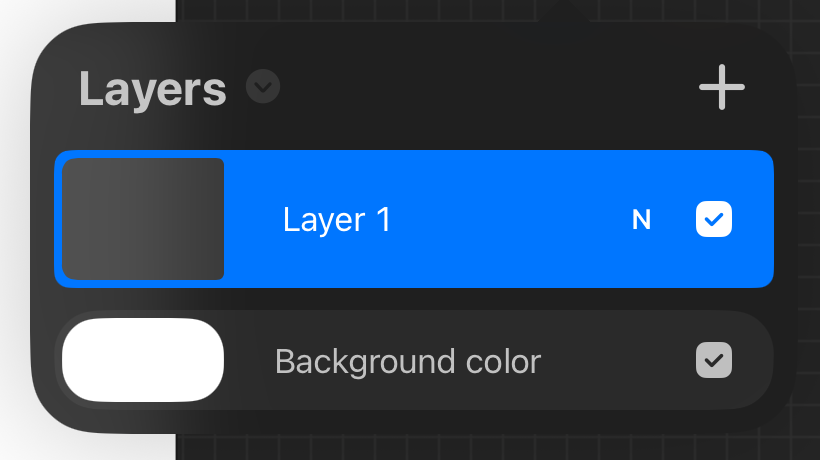
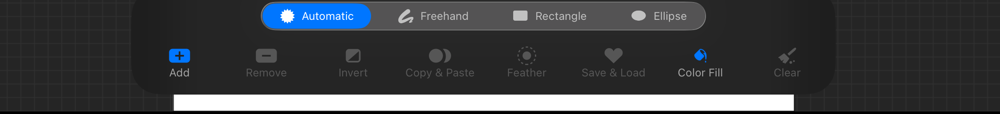
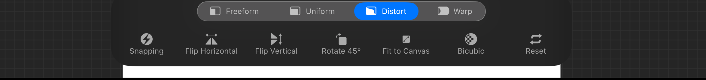
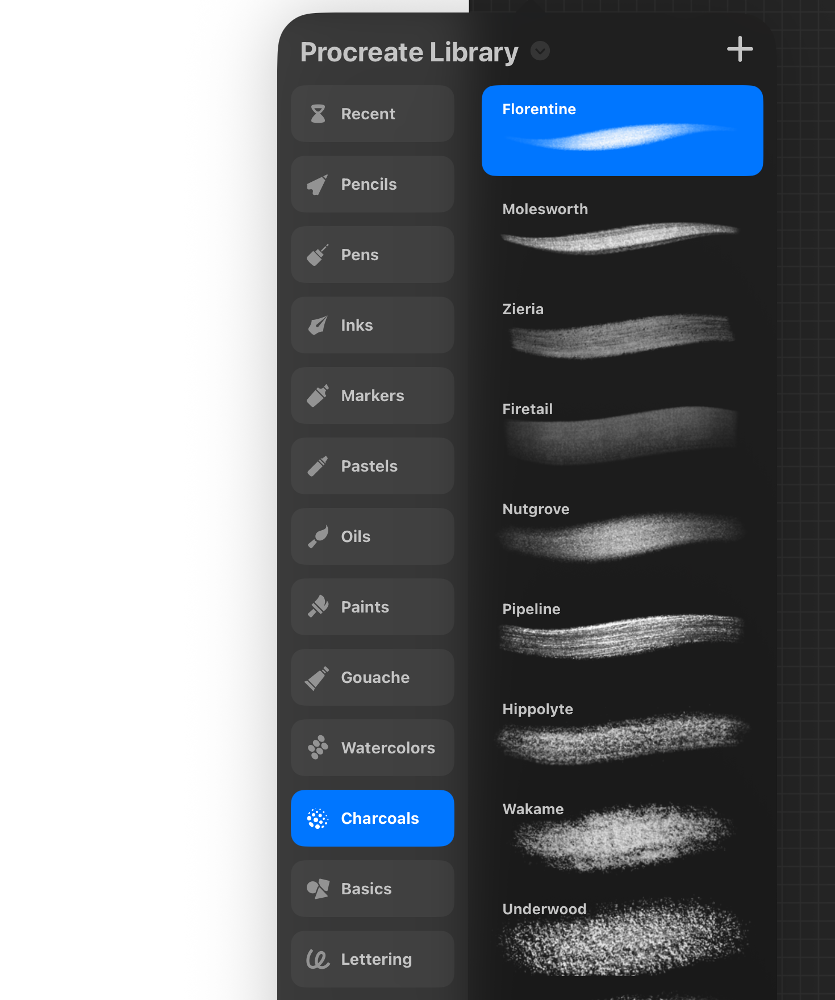
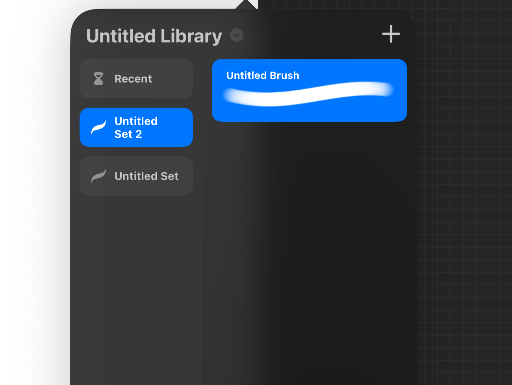

# UI Gaps — Procreate Parity Audit

**Purpose:** hand-off document for a fixing agent. Every finding below is already
cross-referenced against the reference screenshots and the three Procreate PDF
handbooks, so **you do not need to re-scan `Screenshots/` or the PDFs.**

## Read this first

1. **Nothing here is verified against rendered output** (one exception, below).
   `PaintView.swift:7`, `PaintView.swift:122` and `MetalCanvasView.swift:9` all
   carry an explicit `UNVERIFIED` marker — the app has never been run on a device
   or simulator. This audit is **static code-vs-reference analysis only**. Treat
   every claim as "the code says X", not "the app renders X".
   - **Exception:** finding #2 (clipping masks) has since been implemented in Core
     and is **test-verified** — 13 passing tests, full suite 213/213.
   - **Companion doc:** `FEATURE_ROADMAP.md` covers *absent features* from the PDF
     handbooks; this file covers *fidelity defects* in what already exists.
   - **To run tests here:** `xcode-select` points at CommandLineTools (no
     `XCTest`), so use
     `DEVELOPER_DIR=/Applications/Xcode.app/Contents/Developer swift test --disable-sandbox`
2. **`Screenshots/procreate_handbook/brush_transform_adjustments_report.md` is
   stale — ignore it.** It references `ContentView.swift` and
   `TransformSession.swift`, neither of which exists in the current `Sources/`.
   It is a leftover from the earlier web POC. This document supersedes it.
3. **No PDF-vs-screenshot conflicts were found.** Wherever both sources covered
   the same surface (Actions tab order, Adjustments grouping, selection and
   transform bottom-bar contents) they agreed, so the "screenshots win" rule
   never had to be applied.
4. **Reference screenshots are 2752×2064 (landscape iPad).** Cropped regions of
   interest live in `Screenshots/ui_gaps/` and are linked per finding.

## Screenshot index (corrected)

Two mappings were wrong in earlier analysis passes and are corrected here:

| Screenshot | Actually shows |
|---|---|
| `IMG_0001.PNG` | Bare canvas + full top bar (source for the selection glyph) |
| `IMG_0002.PNG` | Brush library popover, **small** (1 set selected, 1 brush) + anchor tail |
| `IMG_0003.PNG` | Brush library popover, **tall** ("Procreate Library", 15 sets, textured thumbnails) |
| `IMG_0004.PNG` | Brush library popover, "Untitled Library" variant |
| `IMG_0005.PNG` | **Layers panel** (Layer 1 + Background color, "N" badge) |
| `IMG_0006.PNG` | Bare canvas, no panel open — *not* the layers panel |
| `IMG_0007.PNG` | Actions (wrench) menu |
| `IMG_0008.PNG` | Adjustments menu |
| `IMG_0009.PNG` | Selection mode bottom bar |
| `IMG_0010.PNG` | Transform mode bottom bar |

## Finding count

20 raw findings were logged across two audit passes (`S1`–`S8` from the
screenshot pass, `P1`–`P12` from the PDF pass). **S6 and P1 are the same defect**
(missing Color Panel) seen from two sources, so there are **19 distinct fixes**.
Provenance IDs are retained for traceability.

## Suggested order of work

Group A first (Core data models — pure, unit-testable, no device risk), then
Group C item #9 (highest value-per-effort: Core already supports it), then the
rest. Groups B/C/D are app-layer and carry device risk.

---

# Group A — Core data-model gaps

These block UI work and are pure logic, so they are unit-testable without a
device. Do these first.

### 1. No selection / mask model anywhere in `PaintCoachCore` — `[P6]`
- **Where:** `Sources/PaintCoachCore/Document/DocumentCommand.swift`
- **Missing:** no selection command case, no stored selection state, no mask buffer.
- **Reference:** PDF Part 3 Ch.4 — selections must actually mask paint, work
  across layers, and support Invert / Feather.
- **Blocks:** finding #13.

### 2. Clipping-mask Core layer — **DONE AND TESTED** (was: missing) — `[P9]`
- **Superseded:** this finding said no clipping-mask representation existed. That
  is **no longer true.** Uncommitted working-tree changes add
  `Layer.isClippingMask` (`Layer.swift:22`),
  `DocumentCommand.setLayerClippingMask` with an undo inverse and a
  `layerNotClippable` guard (`DocumentCommand.swift:18, 78-86`), and
  `Document.clippingBase(for:)` (`Document.swift:65-77`).
- **Verified:** `ClippingMaskTests.swift` — 13 tests passing; full suite 213/213.
- **Remaining work is UI/render only** — see `FEATURE_ROADMAP.md` F6.

### 3. No fill / ColorDrop command — `[P5]`
- **Where:** `Sources/PaintCoachCore/Document/DocumentCommand.swift`
- **Missing:** no bucket-fill case.
- **Reference:** PDF Part 3 leans on ColorDrop repeatedly for filling shapes and
  building clipping masks.

### 4. No QuickShape in the stroke pipeline — `[P4]`
- **Where:** `Sources/PaintCoachCore/Input/StrokeBuilder.swift`,
  `Sources/PaintCoachCore/Brush/StrokePath.swift`
- **Missing:** no shape detection, no snapping. Needs pause-detection mid-stroke
  plus geometry fitting (line / circle / rect).

### 5. No transform / bounding-box math — `[P7]`
- **Where:** `Sources/PaintCoachCore/` (no transform type exists)
- **Missing:** Freeform / Uniform / Distort / Warp modes, snapping guides,
  rotation node.
- **Blocks:** finding #14.

---

# Group B — Missing subsystems (app-layer)

### 6. Color Panel does not exist — `[S6 + P1]`
- **Where:** `PaintView.swift:214` sets `panel = .color`, but the `panelLayer`
  switch (`PaintView.swift:280-303`) has **no `.color` case** — it falls through
  to `default: EmptyView()` at `PaintView.swift:300-301`.
- **Reference:** PDF Part 1 Ch.2 + ProcreateTools Part 3 specify: hue ring +
  saturation disc, Palettes tab with save / set-default, numeric H/S/B sliders,
  double-tap for pure black/white, and a panel draggable around the canvas.
- **Status:** nothing exists, not even a stub view.
- **Blocks:** findings #10 and #12.

### 7. No eyedropper — `[P2]`
- **Where:** `Sources/PaintCoachUI/MetalCanvasView.swift` —
  `touchesBegan` only ever starts a stroke.
- **Missing:** no long-press recognizer, no colour-sampling path.
- **Reference:** PDF Part 1 Ch.5; ProcreateTools p.12-13 (tap-and-hold to sample).

### 8. No multi-finger gestures — `[P3]`
- **Where:** `Sources/PaintCoachUI/MetalCanvasView.swift` tracks only a single
  `activeTouch` for drawing.
- **Missing:** 2-finger tap = undo; 2-finger hold = fast undo; 3-finger tap =
  redo; 3-finger hold = fast redo; 2-finger drag = pan/zoom/rotate; quick pinch =
  fit-to-screen; 3-finger scrub = clear layer.
- **Note:** `model.undo()` / `model.redo()` exist but are wired to sidebar
  buttons only, so the touch-first workflow the handbooks assume is unavailable.
- **Reference:** PDF Part 1, Gestures chapter.

---

# Group C — Inert UI (Core is often already ready)

### 9. Layer Options mostly unwired — Core already supports them — `[P8]`

- **Where:** `PCLayersPanel` in `ProcreatePanels.swift:155-207`
- **Already in Core:** `DocumentCommand` has `renameLayer`, `setLayerOpacity`,
  `setLayerLocked`, `moveLayer`.
- **Exposed in UI:** only tap-to-select (`ProcreatePanels.swift:202-206`) and the
  visibility checkbox (`ProcreatePanels.swift:175-194`).
- **Missing:** swipe-left → Lock / Delete / Duplicate; tap name → Rename;
  tap-and-hold → drag reorder; pinch → merge; multi-select → Group; Group
  Options → Rename / Flatten / collapse.
- **Reference:** PDF Part 3 Ch.3. Screenshot: `IMG_0005.PNG`.
- **Priority: highest value-per-effort in this document** — the Core work is done.

### 10. Layer row "N" badge is a static label — `[P8]`

- **Where:** `ProcreatePanels.swift:168-173` renders `Text("N")`, not a button.
- **Should:** open Blend Modes list + Opacity slider.
- **Depends on:** #6 for any colour-related blend UI.

### 11. Actions menu tabs are decorative except Help — `[P11]`
- **Where:** `PCActionsPanel`, `ProcreatePanels.swift:213-223`. Tab state
  `@State private var tab = 5` changes highlight on tap but the body always
  renders the same three hard-coded `PCMenuGroup`s regardless of selection.
- **Missing content:** Add (insert photo/text), Canvas (crop/resize), Share
  (export format picker), Video, Prefs.
- **Reference:** `IMG_0007.PNG`; PDFs describe real per-tab content.

### 12. Background Color row cannot be recoloured — `[P10]`

- **Where:** `ProcreatePanels.swift:202-206` — the tap handler explicitly ignores
  non-`.paint` rows (`if layer.kind == .paint`).
- **Double dead end:** even if the tap were allowed, there is no Color Panel to
  open (#6).
- **Reference:** PDF Part 3 p.3 — tap Background Color → Color Disc → pick canvas colour.

### 13. Selection bottom bar is UI-only — `[S8 + P6]`

- **Where:** `PaintView.swift:307-327`. Modes and actions are static tuple
  arrays; no handlers are attached.
- **Depends on:** #1 (no selection model exists in Core).
- **Glyph mismatches:** `"circle.dashed"` for *Automatic* (`PaintView.swift:310`)
  where Procreate shows a sunburst/aperture; *Copy & Paste*
  (`"circle.righthalf.filled"`, line 318) and *Save & Load* (`"heart.fill"`,
  line 320) are generic SF Symbol stand-ins.
- **Reference:** `IMG_0009.PNG`; PDF Part 3 Ch.4.

### 14. Transform bottom bar is UI-only — `[P7]`

- **Where:** `PaintView.swift:328-344`. Same pattern — static arrays, no handlers.
- **Depends on:** #5 (no transform math in Core).
- **Reference:** `IMG_0010.PNG`; PDF Part 3 Ch.2.

### 15. Brush-set filtering not implemented — `[S3]`

- **Where:** `PaintView.swift:76` —
  `public var brushesInSelectedSet: [Brush] { brushes }` returns **every** brush
  regardless of `selectedSet`.
- **Expected:** `IMG_0003.PNG` shows the right-hand column swapping entirely when
  a different set (e.g. Charcoals vs Pastels) is tapped.

---

# Group D — Visual fidelity

### 16. Panel size is hardcoded, not adaptive — `[S1]`

- **Where:** `PCBrushLibrary`, `ProcreatePanels.swift:29` —
  `.frame(width: 372, height: 720)`.
- **Expected:** popover fits its content. Compare `IMG_0002.PNG` (1 set, 1 brush
  → small panel) with `IMG_0003.PNG` (15 sets, long list → tall panel). The
  current code renders both at identical size.

### 17. No popover anchor tail — `[S2]`

- **Where:** `PCPanelCard`, `ProcreateTheme.swift:201-212` — plain rounded rect
  plus shadow.
- **Expected:** a triangular tail pointing at the toolbar icon that opened the
  panel. Visible at the top edge of the crop above (`IMG_0002.PNG`), and also on
  the Layers panel in `IMG_0005.PNG`.

### 18. Brush thumbnails are abstract, not textured — `[S4]`

- **Where:** `PCBrushSwatch`, `ProcreatePanels.swift:99-121` — draws a plain
  white bezier curve using stroke width as a softness proxy.
- **Expected:** real grayscale rendered stroke textures — grain, bristle,
  charcoal spatter. See Molesworth / Zieria / Nutgrove / Wakame in the crop.
- **This is the single biggest visual-fidelity gap.**

### 19. Every brush-set row uses the same icon — `[P12]`

- **Where:** `ProcreatePanels.swift:41` — `"paintbrush.pointed.fill"` for all sets.
- **Expected:** distinct per-medium glyphs. From `IMG_0003.PNG`: Recent
  (hourglass), Pencils, Pens, Inks (nib), Markers, Pastels, Oils (brush), Paints,
  Gouache, Watercolors (dots cluster), Charcoals (speckle disc), Basics,
  Lettering (script glyph).

### 20. Library title hardcoded; header dropdown inert — `[S5]`

- **Where:** `ProcreatePanels.swift:19` —
  `PCPanelHeader(title: "Procreate Library") {}` (note the empty action closure).
- **Nuance — earlier analysis was partly wrong:** `IMG_0003.PNG` genuinely reads
  **"Procreate Library"**, so the hardcoded string is not itself a mismatch.
  The real defect is that `IMG_0002.PNG` and `IMG_0004.PNG` show
  **"Untitled Library"** for the same panel — the title must be data-driven
  because the app supports multiple renamable libraries.
- **Also:** the chevron (`ProcreateTheme.swift:225`) is decorative — no menu opens.

### 21. Selection tool glyph mismatch — `[S7]`

- **Where:** `ProcreateTheme.swift:59` — `iconSelect = "lasso"` renders SF
  Symbols' loop-shaped lasso.
- **Expected:** Procreate's distinctive S-curve selection glyph — visible as the
  3rd icon from the left in the crop above (`IMG_0001.PNG`), and consistent
  across all 10 screenshots.

---

## Corrections made during this audit

Recorded so the next agent does not re-inherit the errors:

1. **`circle.dashed` is present, not missing** — it is at `PaintView.swift:310`.
   The defect is that it is the *wrong glyph*, not an absent one.
2. **The Color Panel gap is a `default:` fallthrough**, not an absent enum case —
   `PaintView.swift:300-301`. `panel = .color` is settable; nothing renders.
3. **IMG_0006 is a bare canvas, not the layers panel.** The layers panel is
   **IMG_0005**. An earlier crop against IMG_0006 produced a blank image.
4. **IMG_0003's title really is "Procreate Library"** — matching the hardcoded
   string. See finding #20 for the corrected framing of that defect.

## Commit guidance

Per project convention: keep tested Core changes (Group A) in commits separate
from unverified app-layer changes (Groups B/C/D), so the proven/unproven boundary
stays clean in history. Prefer small, incremental commits. Do not commit
app-layer changes without explicit sign-off from the repo owner.
